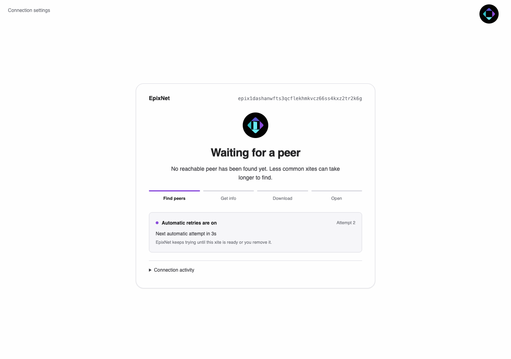
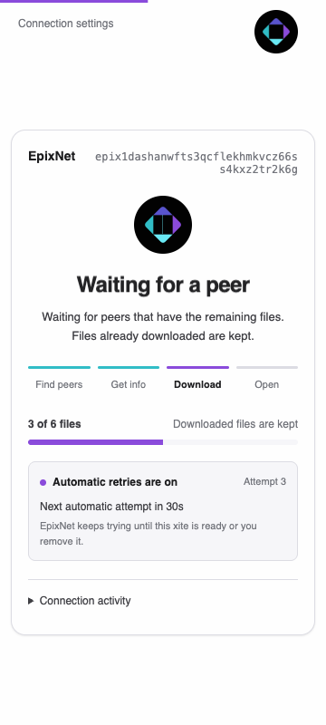

# Xite discovery and download recovery

This focused review exercises tracker discovery, rare xites, interrupted
downloads, automatic retries, and I2P. It supplements the earlier
[review validation](review-validation.md).

## Waiting and recovery

An unsuccessful discovery attempt does not establish that nobody shares the
xite. The waiting screen now explains that no reachable peer has been found
yet, keeps downloaded-file progress visible, and shows the next attempt from
the node's retry deadline. Retrying is automatic, with no retry button and no
page reload. For an unpaused placeholder with networking enabled, attempts
continue until the xite is ready or the placeholder is deleted. Deletion
cancels pending work. Connection details can be expanded when useful.
Unresolved names retry while their page is watching the lookup. Observation
renews a 60-second lease; after it expires, no new background round starts.
An already running lookup retains its bounded request budget.



The same screen supports narrow viewports, dark mode, keyboard navigation, and
reduced motion. A waiting transfer does not report a stale peer as still
sending files.



The screenshots use the production wrapper, stylesheet, and script with a
controlled WebSocket event stream. The fixture represents an uncommon xite;
it does not measure the availability of a public xite.

## Reproduced defects

Bug fixes followed failing executable regressions. The automatic-only waiting
screen implements the requested interaction design.

| Area | Reproduced failure | Resulting behavior |
| --- | --- | --- |
| Waiting screen | Thirty seconds without peers implied a connection problem; the first peer permanently stopped stalled-download feedback. | Gentle waiting feedback remains available without diagnosing an unproven connection failure. |
| Retry recovery | Retrying reloaded the whole page and discarded its visible context. | Automatic attempts preserve the wrapper and saved progress. |
| Document readiness | Receiving `index.html` dismissed the screen before other required files arrived; retryable error documents counted as loaded pages. | Required files remain gated, and the screen dismisses only after the actual document loads. |
| HTTP recovery | Failed discovery left a document request waiting for five minutes, while a failed partial download could serve incomplete HTML. | The server returns an uncached, retryable waiting document with HTTP 503 and `Retry-After`; a later request serves the completed xite. |
| Early and reconnected UI sessions | Events arriving before the first snapshot were lost; retry/progress state disappeared on reconnect. | Initial state is requested immediately and persisted status restores the display. |
| Retry scheduling | Network changes and new peers did not wake scheduled core retries; ordinary requests could bypass backoff. | New evidence and explicit retries wake the relevant work; passive refreshes respect backoff. |
| Automatic-only retry | A fixed scheduler tick missed announced deadlines; a watched name lookup could stop after its request budget or cancellation. | The scheduler follows the earliest pending deadline, wakes when an active attempt ends, and resumes watched unresolved names. Repeated automatic rounds stop after placeholder deletion. |
| Download completion | A resumed download could report completion while required files were still missing. | Completion requires the verified core files to be present. |
| Discovery completion | An empty search could wait another minute after all tracker/PEX requests finished, including a sender-drop timing race. | Explicit producer completion ends an exhausted search promptly. A fast tracker still wins without waiting for a slow one. |
| Download lifecycle | Deleting and re-adding a xite retained its old retry state and detached download. | Deletion cancels the old attempt and clears its retry state. |
| I2P routing | Installing an I2P transport without a base transport left the composed transport unavailable. | I2P-only discovery and fetching can use the installed transport. |
| Mixed tracker results | Twenty newer IP entries crowded the reachable I2P seeder out of an I2P-only client's response. | An I2P-only client requests peers on networks it can dial, preserving the reachable seeder within the response limit. |
| Tracker entries | Malformed or differently spelled I2P claims created unusable entries or returned the announcer itself; passive lookups registered phantom seeders. | Claims are validated and normalized, and passive lookups do not advertise service. |
| Empty listening clients | Twenty clients with no verified manifest filled tracker results and hid a useful partial seeder on both clearnet and I2P. | Self-announcements require a served, verified root. Peers with a verified root and a partial download remain discoverable. |
| Clearnet announcements | A listening seed was omitted from tracker results. | Announcements include the actual listener family while respecting routing policy. |
| Overlay-only operation | Download-only I2P nodes advertised a destination without an inbound handler; the Tor-only TCP listener bound every interface. | I2P service is advertised only after its handler is ready, and the Tor-only listener binds loopback. |
| Retry permissions | A public gateway visitor could inherit the dashboard's ADMIN grant to retry an unrelated xite. | Targeted retry respects the visitor's xite and gateway restrictions. |

## Reproducing the checks

The Rust tests exercise real application state, HTTP responses, tracker
request/reply encoding, signed manifests, and content verification:

```sh
cargo test --locked -p epix-ui --test discovery_wait
cargo test --locked -p epix-ui clone_retry_
cargo test --locked -p epix-node clone_retry_
cargo test --locked -p epix-runtime --test tracker_discovery
cargo test --locked -p epix-runtime --features i2p i2p_startup_tests
cargo test --workspace --all-targets --features epix-runtime/i2p --locked --no-fail-fast
node --test ui/tests/*.test.cjs
node --test crates/epix-browser/tests/pac-routing.test.cjs
```

The controlled I2P tracker tests run the EDX protocol and verification over
mapped local streams. The SAM startup fixture uses a real SAM client against a
local control server. These checks isolate protocol and application behavior;
they do not establish public I2P peer availability.

### Public I2P probe

A separate, bounded probe started two embedded routers on the public I2P
network, with a tracker and signed xite on one router and a downloader on the
other. The first router became ready after 30 seconds. The second connected to
public routers and built tunnels, but its SAM inbound session did not finish
within the five-minute bootstrap deadline. The probe then exited and cleaned
up both routers.

The public tracker-to-download transfer was **inconclusive**. The controlled
tracker, signed-content download, and SAM startup tests passed; this public
attempt does not establish end-to-end availability on the live network.

### Browser regression and screenshots

Install the browser test tools outside the repository, then run the standalone
fixture:

```sh
npm install --prefix /tmp/epix-browser-tools playwright ws
/tmp/epix-browser-tools/node_modules/.bin/playwright install chromium
EPIX_BROWSER_TEST_TOOLS=/tmp/epix-browser-tools/node_modules \
  node ui/tests/loading-browser.cjs
```

`EPIX_TEST_CHROMIUM` can select an existing compatible Chromium executable.
`EPIX_BROWSER_TEST_OUTPUT` selects the directory for screenshots and the JSON
result; by default they are written under the system temporary directory.

This fixture loads the full production wrapper under its nonce-based script
policy. It checks a node-supplied retry countdown, automatic attempts without
navigation or manual commands, preserved file counts, recovery from the waiting
iframe, dismissal after the real page loads, a 360-pixel viewport, keyboard
activity expansion, and reduced motion. It also fails on uncaught page exceptions.

The final Chromium fixture passed with one wrapper request, two iframe requests
(waiting and complete), zero retry buttons, zero manual retry commands, and no
uncaught page errors. It observed attempt 3 begin automatically while keeping
the same wrapper, then restored and retained progress at three of six files.
All **23 wrapper JavaScript tests and one generated proxy-routing test** passed.

### Compiled macOS browser

Built `epix-browser` with the published wallet pin and opened packaged Firefox
140.15.0 with a disposable node/profile. A fresh unseeded xite showed an
eight-second backend countdown and no retry button. With no clicks, the actual
backend advanced from the first connection to attempt 2 after **7.94 seconds**.
The wrapper URL, document marker, and navigation time origin stayed the same;
the waiting screen and wallet provider remained present. Fresh launch took
**5.82 seconds**.

The fixture disabled Beacon and used a reserved, non-listening loopback tracker
so tracker responses remained empty; chain bootstrap could still contact
public servers. The test restored shared Mozilla certificate/native-host files
and removed its temporary profile. Late-peer completion is covered by the Rust
integration test and the Chromium document-recovery fixture above.

## Workspace test fixture correction

The combined run exposed a macOS race in the existing chain attestation mock
server: a stream accepted from a nonblocking listener could return `WouldBlock`
before its request arrived. A standalone socket reproduction returned that
error in less than a microsecond despite a configured read timeout. The fixture
now explicitly makes accepted streams blocking before reading requests. This
changes only test-server behavior.
